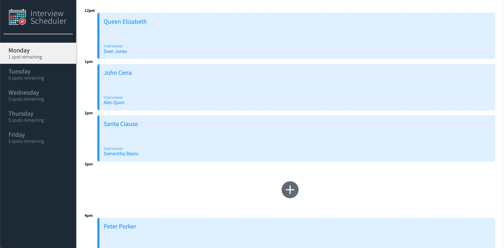
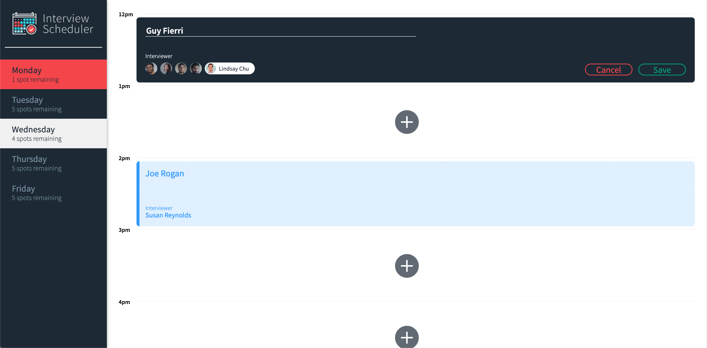
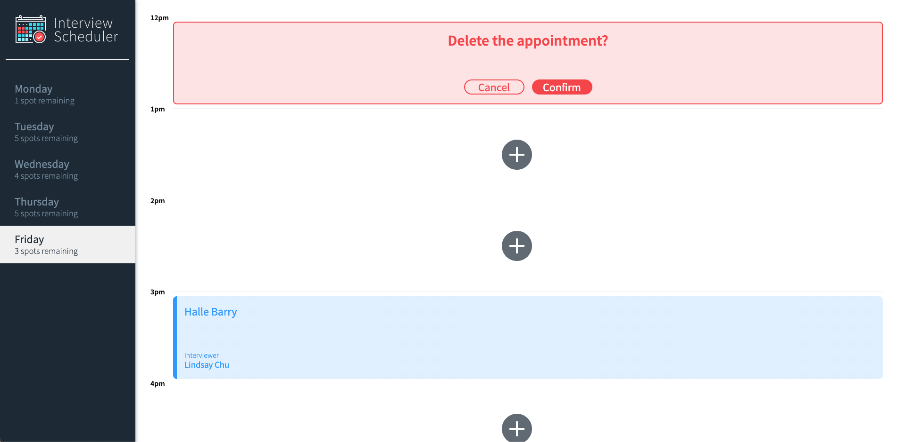
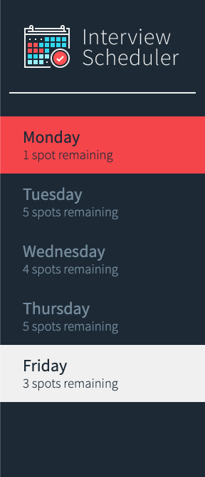
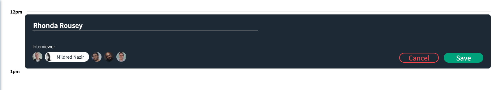

# Interview Scheduler {#intro}

:caledar: ***Interview Scheduler*** :caledar: is a student project at [Lighthouse Labs](https://www.lighthouselabs.ca/) to demonstrate using the :atom_symbol: React :atom_symbol: Front-End library as well as testing frameworks and deployment with continuous integregation.

The site is currently live and deployed with Netlify and hosted on Github and Railway.

If you would like to visit this project in its production version, please visit [here](https://subtle-valkyrie-5383b3.netlify.app/)!

## Gallery {#gallery}

### Application Main Page



> Main page of application with empty and scheduled interview appointments

### Schedule an Interview



> Scheduling a new interview for Guy Fierri with Lindsay Chu

### Delete Interviews



> Delete uneeded interviews, complete with confirmation landing page for safety

### Sidebar with List of Days



> Sidebar with selection and hover features to show selected day as well as how many appointment slots are remaining

### Edit Interviews



> Edit interviews with form prepopulated for convenience

### Appointment Details


> Scheduled interviews indicate the name of the interviewer and interviewee

## Setup

Install dependencies with `npm install`.

## Running Webpack Development Server

```sh
npm start
```

## Running Jest Test Framework

```sh
npm test
```

## Running Storybook Visual Testbed

```sh
npm run storybook
```
