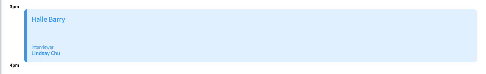

# Interview Scheduler

## Intro

:calendar: ***Interview Scheduler*** :calendar: is a student project at [Lighthouse Labs](https://www.lighthouselabs.ca/).

* A single page application (SPA) built using :electron: React :electron:.
* Data persisted by the API server using a :elephant: PostgreSQL database :elephant:.
* The client application communicates with an API server over :abacus: HTTP :abacus:, using the :wavy_dash: JSON format :wavy_dash:.
* Multi-client communication via :electric_plug: Websocket :electric_plug:
* :black_joker: Jest :black_joker: tests are used through the development of the project.
* Frontend prototypign done with :books: Storybook :books:, and End-to-End testing done with :evergreen_tree: Cypress :evergreen_tree:.

*The site is currently live and deployed with Netlify and hosted on Github and Railway.*

**If you would like to visit this project in its production version, please visit *[here](https://subtle-valkyrie-5383b3.netlify.app/)*!**

## Tech Stack

### Front-End
* React
* Sass

### Back-End
* Node
* PostgreSQL

### Testing
* Storybook
* Jest
* Cypress

### Deployment
* Github
* CircleCI
* Railway
* Netlify

## Gallery

### Application Main Page


> Main page of application with empty and scheduled interview appointments

### Schedule an Interview


> Scheduling a new interview for Guy Fierri with Lindsay Chu

### Delete Interviews


> Delete interviews, complete with confirmation landing page for safety

### Sidebar with List of Days


> Sidebar with selection and hover features to show selected day as well as how many appointment slots are remaining

### Edit Interviews


> Edit interviews with form prepopulated for convenience

### Appointment Details



> Scheduled interviews indicate the name of the interviewer and interviewee

## Setup

Install dependencies with `npm install`.

## Running Webpack Development Server

```sh
npm start
```

## Running Jest Test Framework

```sh
npm test
```

## Running Storybook Visual Testbed

```sh
npm run storybook
```
